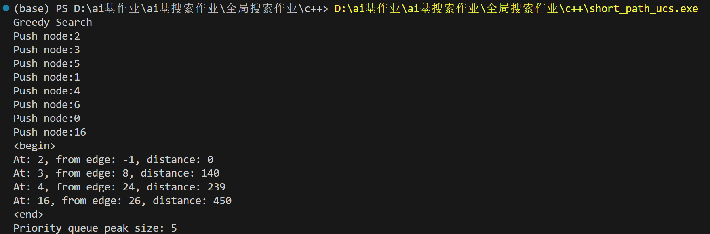

# 测试

# 一级标题

## 二级标题

### 三级标题

这是普通段落，包含**粗体**、*斜体*、~~删除线~~、`行内代码`。

- 无序列表项1
- 无序列表项2，有`代码`
- 无序列表项3

1. 有序列表1
2. 有序列表2

> 这是引用内容
> 引用第二行

```cpp
#include <iostream>
int main() {
    std::cout << "代码块测试" << std::endl;
    return 0;
}
```

---

| 列A | 列B | 列C |
|---|---|---|
| 数据1 | 数据2 | 数据3 |
| `code` | **粗** | *斜* |